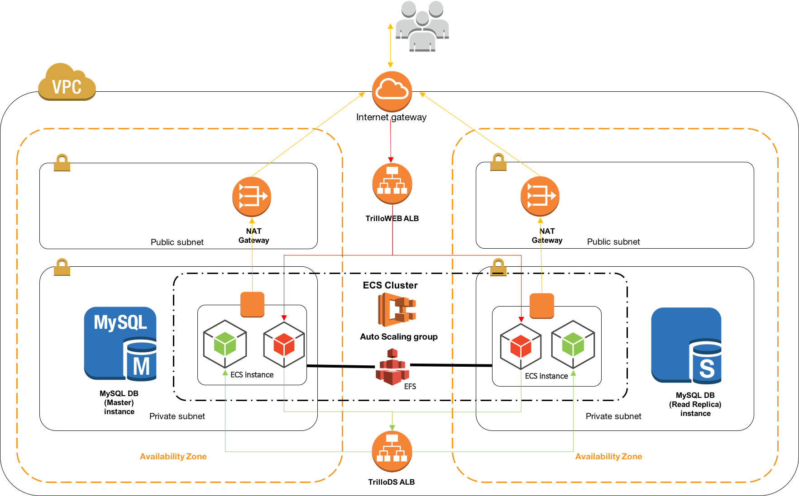
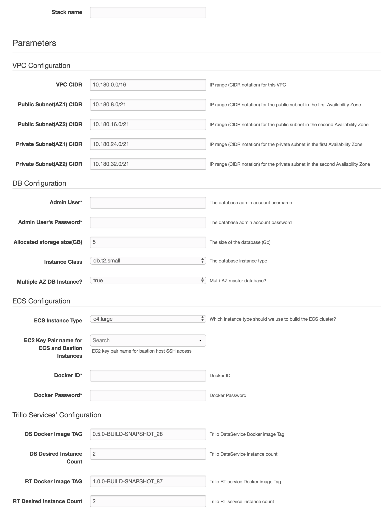
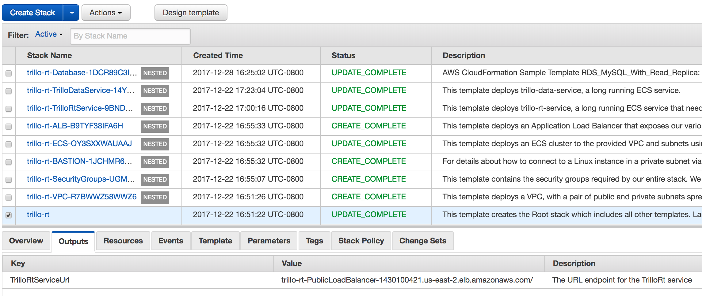
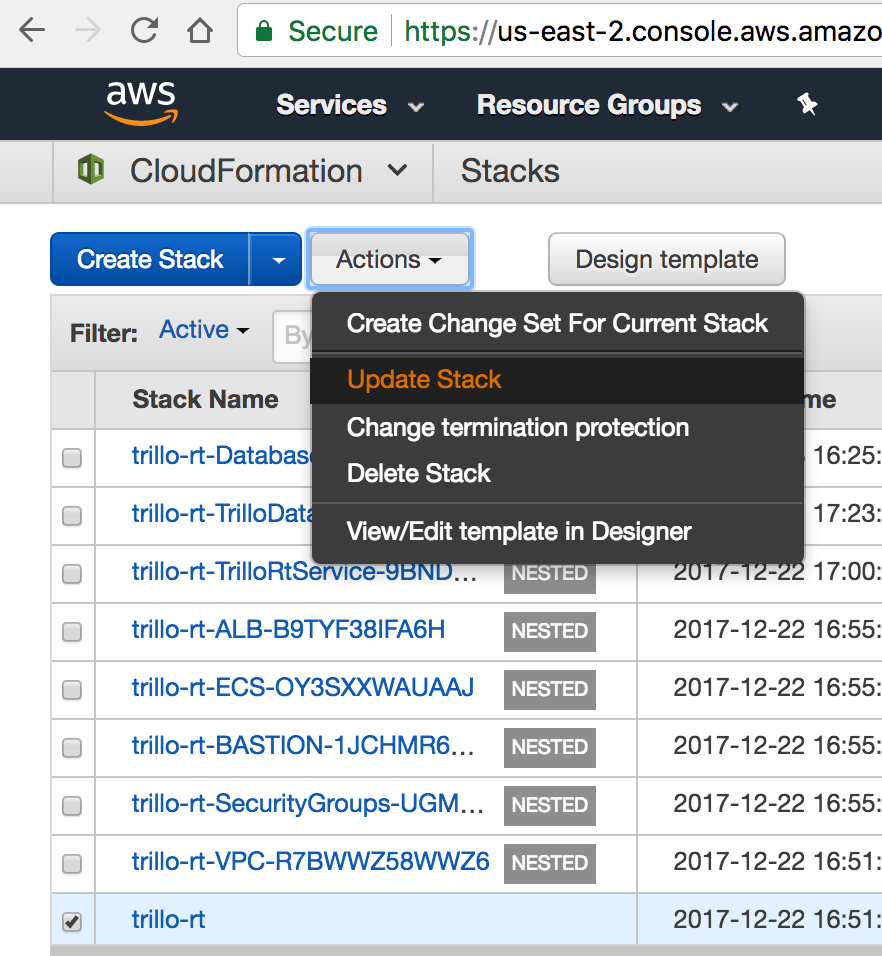

# CloudFormation templates for Deploying Trillo-RT on AWS

This repository provides a set of YAML templates for deploying trillo-rt services to [Amazon EC2 Container Service (Amazon ECS)](http://docs.aws.amazon.com/AmazonECS/latest/developerguide/Welcome.html) with [AWS CloudFormation](https://aws.amazon.com/cloudformation/).

You can launch this CloudFormation stack in the US East (Ohio) Region in your account:

## Video Instructions

## 1. Overview

The repository consists of a set of nested templates that deploy the following:

 - A tiered [VPC](http://docs.aws.amazon.com/AmazonVPC/latest/UserGuide/VPC_Introduction.html) with public and private subnets, spanning an AWS region.
 - A highly available ECS cluster deployed across two [Availability Zones](http://docs.aws.amazon.com/AWSEC2/latest/UserGuide/using-regions-availability-zones.html) in an [Auto Scaling](https://aws.amazon.com/autoscaling/) group.
 - A pair of [NAT gateways](http://docs.aws.amazon.com/AmazonVPC/latest/UserGuide/vpc-nat-gateway.html) (one in each zone) to handle outbound traffic.
 - Two interconnecting micro-services deployed as [ECS services](http://docs.aws.amazon.com/AmazonECS/latest/developerguide/ecs_services.html) (trillo-rt-service and trillo-data-service).
 - An internet facing [Application Load Balancer (ALB)](https://aws.amazon.com/elasticloadbalancing/applicationloadbalancer/) for trillo-rt-service(s) .
 - An internal [Application Load Balancer (ALB)](https://aws.amazon.com/elasticloadbalancing/applicationloadbalancer/) for trillo-data-service(s).
 - A pair (Master and Read Replica) of RDS MySQL instances in each availability zones
 - A bastion host for development/debug
 - Centralized container logging with [Amazon CloudWatch Logs](http://docs.aws.amazon.com/AmazonCloudWatch/latest/logs/WhatIsCloudWatchLogs.html).

## 2. Deployment

Trillo RT AWS CloudFormation stack can be created and Updated using AWS Management Console or AWS CLI and make.
If you want to work with AWS CLI + make, please take a look at the [Makefile](Makefile) for complete list of customizations.

### 2.1 How to create the stack?

#### 2.1.1 AWS Management Console

Click 
and input the stack name and other parameters and follow on screen instructions to submit stack creation.

And take the note of TrilloRtServiceUrl from the Outputs tab.

#### 2.1.2 AWS CLI + make

Assuming that the [AWS CLI](https://docs.aws.amazon.com/cli/latest/userguide/installing.html) is installed and configured, its as simple as running the following make command

`$ make create-stack  TRILLO_DOCKER_ID=<docker-id> TRILLO_DOCKER_PASSWORD=<password>`

### 2.2 How to update the stack?

#### 2.2.1 AWS Management Console

Login into [AWS Management Console](https://us-east-2.console.aws.amazon.com/cloudformation/home), choose the already created Trillo RT stack, 
select `Update Stack` from `Actions` and follow on screen instructions to submit stack update.

#### 2.2.2 AWS CLI + make

Assuming that the [AWS CLI](https://docs.aws.amazon.com/cli/latest/userguide/installing.html) is installed and configured, its as simple as running the following make command

`$ make update-stack  TRILLO_DOCKER_ID=<docker-id> TRILLO_DOCKER_PASSWORD=<password>`

## 3. Template details

The templates below are included in this repository:

| Template | Description |
| --- | --- |
| [master.yaml](master.yaml) | This is the master template - deploy it to CloudFormation and it includes all of the others automatically. |
| [infrastructure/vpc.yaml](infrastructure/vpc.yaml) | This template deploys a VPC with a pair of public and private subnets spread across two Availability Zones. It deploys an [Internet gateway](http://docs.aws.amazon.com/AmazonVPC/latest/UserGuide/VPC_Internet_Gateway.html), with a default route on the public subnets. It deploys a pair of NAT gateways (one in each zone), and default routes for them in the private subnets. |
| [infrastructure/security-groups.yaml](infrastructure/security-groups.yaml) | This template contains the [security groups](http://docs.aws.amazon.com/AmazonVPC/latest/UserGuide/VPC_SecurityGroups.html) required by the entire stack. They are created in a separate nested template, so that they can be referenced by all of the other nested templates. |
| [infrastructure/load-balancers.yaml](infrastructure/load-balancers.yaml) | This template deploys ALBs to the public subnets, which exposes the various ECS services. They are created in in a separate nested template, so that they can be referenced by all of the other nested templates and so that the various ECS services can register with them. |
| [infrastructure/ecs-cluster.yaml](infrastructure/ecs-cluster.yaml) | This template deploys an ECS cluster to the private subnets using an Auto Scaling group. |
| [infrastructure/database.yaml](infrastructure/database.yaml) | This template deploys a pair of MySQL instances (Master and Read Replica) in RDS. |
| [infrastructure/bastion.yaml](infrastructure/bastion.yaml) | This template deploys a bastion-host(also called jump-host) for admin access. |
| [services/trillo-rt-service.yaml](services/trillo-rt-service.yaml) | This template deploys ECS container for trillo-rt-service. |
| [services/trillo-data-service.yaml](services/trillo-data-service.yaml) | This template deploys ECS container for trillo-data-service . |

## 4. References

- https://github.com/awslabs/ecs-refarch-cloudformation
- https://github.com/awslabs/amazon-ecs-amazon-efs
- https://docs.aws.amazon.com/AmazonECS/latest/developerguide/container-metadata.html
- https://aws.amazon.com/blogs/devops/construct-your-own-launch-stack-url
- https://docs.aws.amazon.com/eks/latest/userguide/getting-started.html

## 5. OpenSource Licenses

- https://github.com/opentrillo/install-centos
